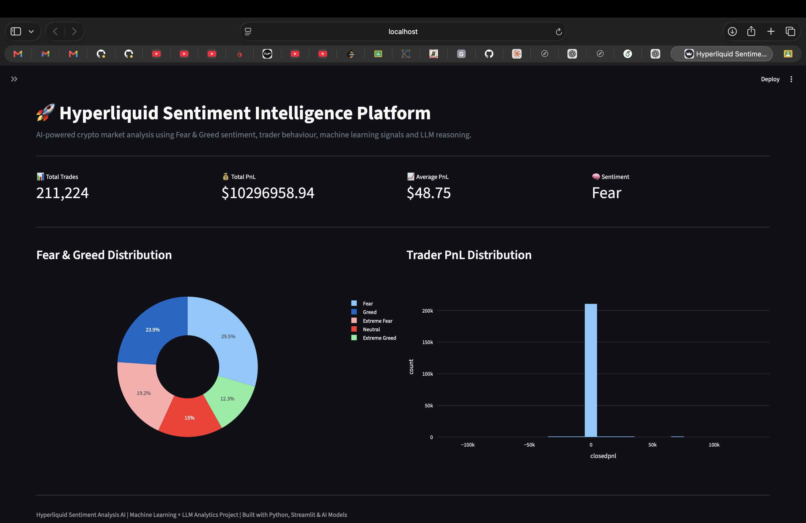
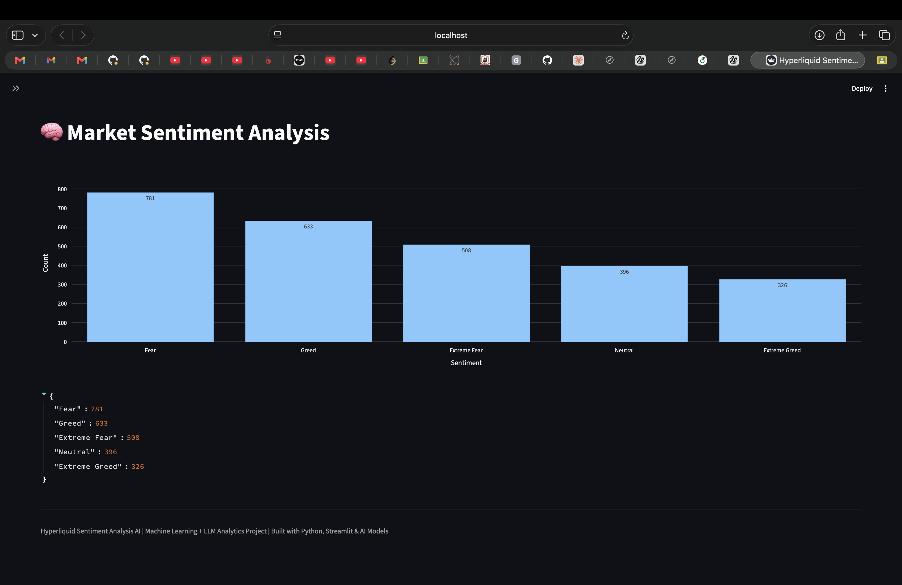
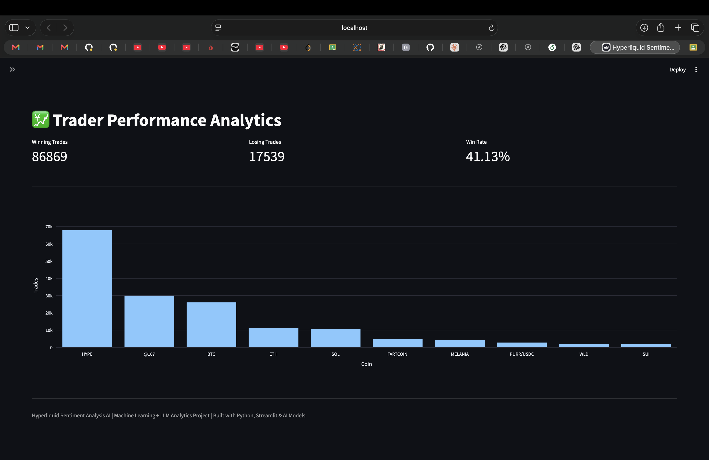
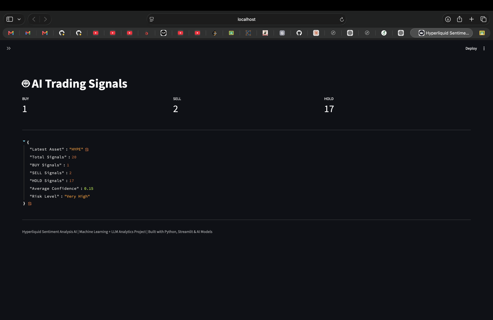
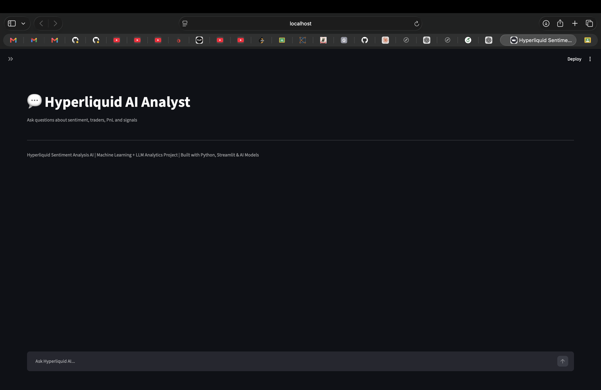

# 🚀 Hyperliquid Sentiment Analysis AI


# 📌 Overview

**Hyperliquid Sentiment Analysis AI** is an end-to-end Artificial Intelligence and Machine Learning platform that analyzes the relationship between:

- Crypto market sentiment
- Trader behaviour
- Profitability patterns
- Trading signals
- Risk conditions


The system combines:

- Bitcoin Fear & Greed Index data
- Hyperliquid historical trader execution data
- Machine learning prediction models
- Confidence-based signal generation
- LLM-powered AI financial analytics assistant


The objective is to understand how market psychology impacts trader performance and generate explainable AI-driven insights.

---

# ✨ Features


## 📊 Market Sentiment Analysis

The platform analyzes market psychology using Fear & Greed indicators.

Features:

- Fear / Greed classification
- Extreme sentiment detection
- Sentiment distribution analysis
- Market condition evaluation


---

## 💹 Trader Performance Analytics

The system evaluates historical trader behaviour.

Analytics include:

- Profit and Loss analysis
- Winning and losing trades
- Trading frequency
- Coin-wise trading behaviour
- Position behaviour
- Leverage utilization


---

## 🤖 Machine Learning Trading Signals

The ML pipeline generates automated trading signals:

| Signal | Meaning |
|---|---|
| 🟢 BUY | Positive market opportunity |
| 🔴 SELL | Negative market condition |
| 🟡 HOLD | Low confidence / uncertain condition |


Each prediction contains:

- Asset
- Prediction probability
- Confidence score
- Risk level
- Position sizing recommendation


---

## 💬 AI Market Analyst

An integrated LLM-based assistant provides natural language access to analytics.

The AI assistant can answer:

- How did traders perform during Fear periods?
- Which coins generated the highest profits?
- What is the current market sentiment?
- Explain the latest trading signals.
- Summarize trader behaviour patterns.


---

# 🏗 System Architecture

The Hyperliquid Sentiment Analysis AI platform follows an end-to-end AI/ML pipeline architecture integrating market sentiment, trader analytics, machine learning prediction, and LLM-based insights.

```text

                    ┌──────────────────────────┐
                    │       Data Sources        │
                    ├──────────────────────────┤
                    │                          │
                    │ Hyperliquid Trader Data  │
                    │ - Executions             │
                    │ - Positions              │
                    │ - PnL                    │
                    │ - Leverage               │
                    │                          │
                    │ Fear & Greed Index       │
                    │ - Sentiment              │
                    │ - Market Psychology      │
                    │                          │
                    └─────────────┬────────────┘
                                  │
                                  ↓

                    ┌──────────────────────────┐
                    │ Data Processing Layer    │
                    ├──────────────────────────┤
                    │                          │
                    │ Data Loading             │
                    │ Data Cleaning            │
                    │ Missing Value Handling  │
                    │ Normalization            │
                    │ Feature Preparation      │
                    │                          │
                    └─────────────┬────────────┘
                                  │
                                  ↓

                    ┌──────────────────────────┐
                    │ Feature Engineering      │
                    ├──────────────────────────┤
                    │                          │
                    │ Trader Features          │
                    │ - Win/Loss Patterns     │
                    │ - Trading Frequency     │
                    │ - Position Behaviour    │
                    │                          │
                    │ Market Features          │
                    │ - Sentiment State       │
                    │ - Market Conditions     │
                    │                          │
                    └─────────────┬────────────┘
                                  │
                                  ↓

                    ┌──────────────────────────┐
                    │ Machine Learning Layer   │
                    ├──────────────────────────┤
                    │                          │
                    │ Classification Models    │
                    │ Prediction Probability  │
                    │ Confidence Estimation   │
                    │ Risk Assessment         │
                    │                          │
                    └─────────────┬────────────┘
                                  │
                                  ↓

                    ┌──────────────────────────┐
                    │ Signal Generation Engine │
                    ├──────────────────────────┤
                    │                          │
                    │ BUY Signal              │
                    │ SELL Signal             │
                    │ HOLD Signal             │
                    │                          │
                    │ Position Size           │
                    │ Confidence Score        │
                    │ Risk Level              │
                    │                          │
                    └─────────────┬────────────┘
                                  │
                                  ↓

                    ┌──────────────────────────┐
                    │ AI Analytics Assistant   │
                    ├──────────────────────────┤
                    │                          │
                    │ LLM Reasoning            │
                    │ Market Explanation      │
                    │ Performance Insights    │
                    │ Natural Language Query  │
                    │                          │
                    └─────────────┬────────────┘
                                  │
                                  ↓

                    ┌──────────────────────────┐
                    │ Streamlit Dashboard      │
                    ├──────────────────────────┤
                    │                          │
                    │ Analytics Dashboard      │
                    │ Trading Signals          │
                    │ Sentiment Charts         │
                    │ AI Chat Interface        │
                    │                          │
                    └──────────────────────────┘

```

---

# 🔄 Machine Learning Workflow


## 1. Data Collection

The system processes two primary datasets.


### Hyperliquid Historical Trader Data

Contains:

- Account information
- Coin symbol
- Execution price
- Trade size
- Position information
- Buy/Sell side
- Closed PnL
- Leverage


### Bitcoin Fear & Greed Index

Contains:

- Date
- Sentiment classification
- Market psychology indicators


---

# 2. Data Preprocessing

The preprocessing pipeline performs:

- Data loading
- Data cleaning
- Timestamp conversion
- Numerical conversion
- Missing value handling
- Dataset synchronization
- Feature normalization


---

# 3. Feature Engineering


## Trader Behaviour Features

Generated features:

- Average profit/loss
- Win ratio
- Trading frequency
- Position behaviour
- Leverage utilization


## Sentiment Features

Generated features:

- Fear periods
- Greed periods
- Extreme market conditions
- Sentiment transitions


---

# 4. Machine Learning Prediction


The ML pipeline generates:

- Market behaviour predictions
- Trading probability scores
- Confidence values
- Risk classification


Workflow:

```text
Prediction Probability

        ↓

Confidence Score

        ↓

Trading Decision

        ↓

Risk Assessment
```


---

# 🤖 Machine Learning Models


The project architecture supports:

- Logistic Regression baseline model
- XGBoost classifier
- Time-series validation
- Threshold optimization
- Confidence-based prediction


---

# 🧠 AI Assistant Architecture


The integrated AI analyst provides natural language access to analytics.


```text

User Query

      ↓

LLM Agent

      ↓

Analytics Tools

      ↓

Dataset / Model Outputs

      ↓

AI Generated Explanation

```


Example queries:

```
How did traders perform during Fear periods?

Which coins generated the highest profit?

Explain the latest trading signals.

What is the current market sentiment?
```


---

# 📈 Results & Insights


The system generates:

- Sentiment-based trader analysis
- Automated BUY/SELL/HOLD signals
- Confidence-aware predictions
- Risk classification


Example output:

| Asset | Signal | Confidence | Risk |
|---|---|---|---|
| HYPE | HOLD | Very Low | Very High |
| HYPE | BUY | Low | High |
| HYPE | SELL | Medium | Medium |


---

# 📊 Dashboard Modules


## 🏠 Overview Dashboard

Provides:

- Total trades
- Total PnL
- Average PnL
- Market sentiment overview
- Performance visualization


## 🧠 Sentiment Analysis

Provides:

- Fear & Greed distribution
- Market psychology analysis
- Sentiment trends


## 💹 Trader Performance

Provides:

- Winning trades
- Losing trades
- Win rate
- Top traded assets


## 🤖 Trading Signals

Provides:

- BUY / SELL / HOLD signals
- Confidence scores
- Risk classification


## 💬 AI Chatbot

Provides:

- Market explanation
- Trader behaviour analysis
- Signal interpretation


---

# 📸 Dashboard Preview


## Overview




## Sentiment Analysis




## Trader Performance




## Trading Signals




## AI Chatbot




---

# 🛠 Technology Stack


## Programming

- Python 3.10+
- Pandas
- NumPy


## Machine Learning

- Scikit-learn
- XGBoost


## Visualization

- Streamlit
- Plotly


## Artificial Intelligence

- LLM Agent Architecture
- AI Analytics Tools
- Natural Language Reasoning


---

# 📂 Project Structure


```text
Hyperliquid-Sentiment-Analysis/

│
├── dashboard.py
├── main.py
├── requirements.txt
│
├── src/
│   ├── chatbot/
│   │   ├── agent.py
│   │   └── tools.py
│   │
│   ├── models/
│   ├── preprocessing/
│   ├── validation/
│   └── loader.py
│
├── data/
│
├── results/
│
├── assets/
│   └── screenshots/
│
└── notebooks/

```


---

# ⚙️ Installation


Clone repository:


```bash
git clone https://github.com/princesaini0825/Hyperliquid-Sentiment-Analysis.git
```


Move into project:


```bash
cd Hyperliquid-Sentiment-Analysis
```


Create virtual environment:


```bash
python -m venv .venv
```


Activate environment:


### macOS/Linux

```bash
source .venv/bin/activate
```


Install dependencies:


```bash
pip install -r requirements.txt
```


---

# ▶ Run Dashboard


Start Streamlit:


```bash
streamlit run dashboard.py
```


Open:


```
http://localhost:8501
```


---

# 🚀 Future Improvements


Planned improvements:

- Real-time Hyperliquid API integration
- Live market monitoring
- Advanced time-series forecasting
- Reinforcement learning trading agent
- Real-time AI market assistant


---

# 🎯 Project Impact


This project demonstrates the integration of:

- Machine Learning
- Financial Data Analytics
- LLM-based AI Agents
- Explainable AI
- Interactive Visualization


for intelligent market behaviour analysis.


---

# 👨‍💻 Author


**Prince Saini**

AI/ML Research Engineer Aspirant


GitHub:

https://github.com/princesaini0825
